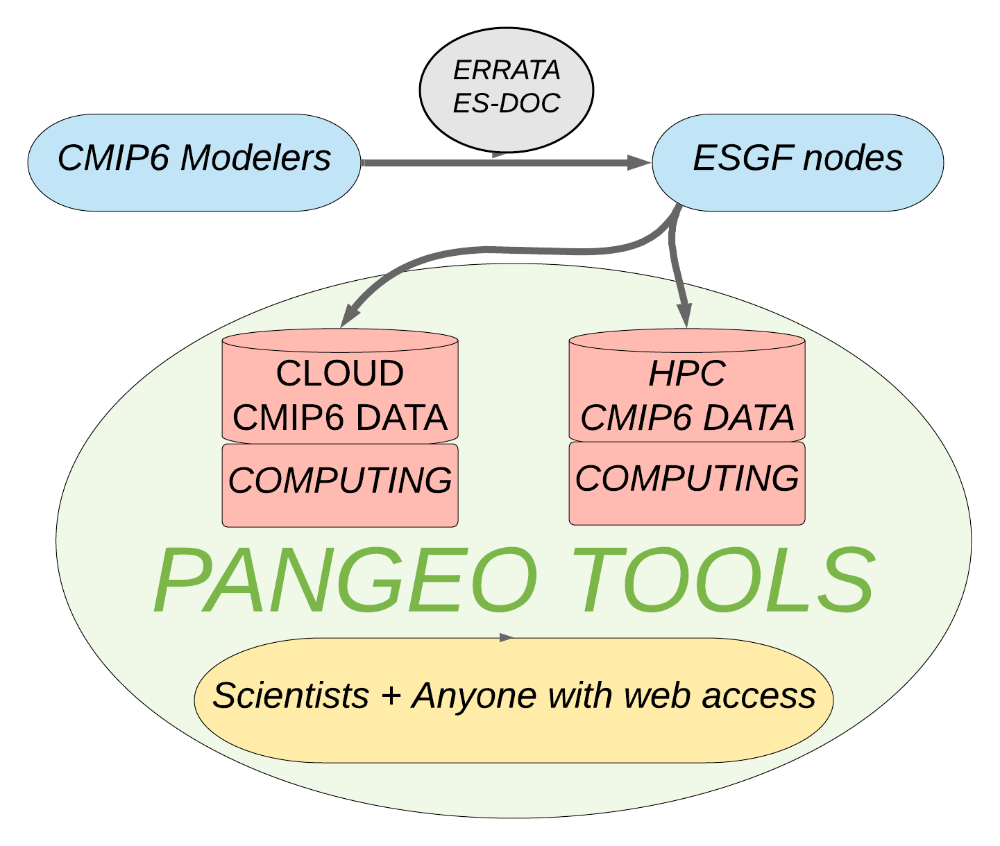
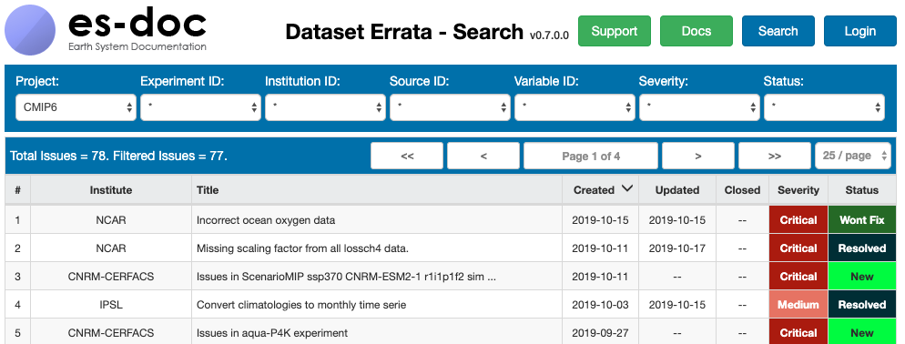
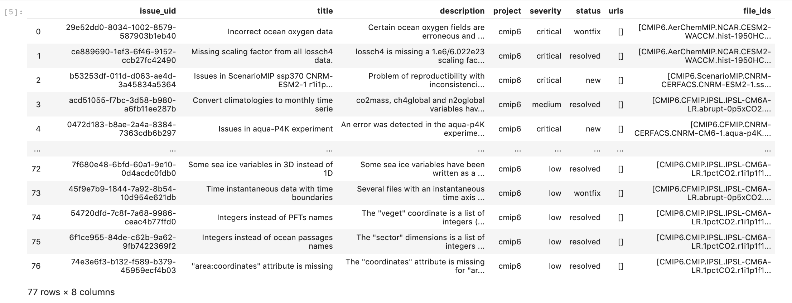

# CMIP6 Hackathon Data Cleaning/Preprocessing Project  
**LDEO**, October 16-18, 2019

## The CMIP6 Data Challenge
Our Google Cloud CMIP6 zarr repository currently contains contributions from 23 institutions with 48 models. Gerald Meehl/UCAR explained in the opening session of the Hackathon, as has happened with prior CMIPs, that the modelers initially promised to run many experiments. But time goes by quickly, deadlines are missed and there is now a rush to get the data out, leading to inevitable inconsistencies.

Although the amount of data is overwhelming, it is all very precious.  It has been a labor of love for all involved and we would like to make it as accessible to the world-wide community as possible. For CMIP3 and expecially CMIP5 collections, we each faced the Data Cleaning chore on our own - every researcher had to repeat the same process of discovering and fixing a myriad of little issues in order to calculate multimodel statistics, sometimes with erroneous results. One of the goals of this CMIP hackathon is to develop methods to streamline this often extremely tedious but essential process. The integrity of our science depends on it.

## Current Status of our Google Cloud and NCAR/Glade CMIP6 collections
- A large chunk of CMIP6 data is collected at a few large sites - the ESGF nodes.  But another chunk of data remains at the home institution and must be downloaded from there. Transfers can be fast, 100Mbps, but can also be as slow as 100Kbps. All of the servers go up and down. Recently, even the LLNL ESGF search API has been inaccessible almost every weekend.

- We have collected a very small subset - about 600,000 netcdf files at NCAR/Glade, most < 2.1 G, split in `time` dimension.

- We have concatenated the netcdf files in time (using `xarray`, saving as `zarr` stores). We currently have about 30,000 zarr stores in Google Cloud. The time concatenation is problematic, but, once completed,  greatly reduces the work needed downstream to prepare data for research.

## Data Cleaning has many aspects:

Types of issues:
- **Hopeless cases** : those needing to be fixed or withdrawn by their creators
- **Fixable cases** : duplicate times, mismatched coordinate names, time gaps in data, etc
- **Enhance-able cases** : there are improvements we would like to make before aggregating the data in order to expedite our Pangeo methods

Existing and proposed solutions:
- The official CMIP6 errata database: [The ES-DOC Errata Search](https://errata.es-doc.org/static/index.html) is used to document withdrawn, replaced or incorrect data. These are formal issues (all affected files are listed) which need to be fixed by the Modeling Centers themselves. **Contributors: Data Providers**

- Database of datasets which need special treatment when concatenating the netcdf files in time (@naomi-henderson). **Contributors: Data Brokers** (those downloading from ESGF and collecting in external data servers)

- Methods for preprocessing the dataset grids (@jbusecke) **Contributors: Data Facilitators** (like `intake-esg`)

- A crowd-sourced database of how to fix various datasets (correct units, deal with slightly offset grids, etc). **Contributors: Data Consumers** (all of us)

## This Project

- **Part 1.** 
Turning the ES-DOC Errata Search into a database in python to quickly identify and isolate troublesome data.  This involves parsing the online search tool to obtain a spreadsheet of issues, current status and list of affected files. The spreadsheet uses the same keywords as the catalogs, which allows for easy identification. See [ES-DOC-retrieve.ipynb](https://github.com/naomi-henderson/cmip6hack-DataCleaning/blob/master/notebooks/ES-DOC-retrieve.ipynb)

- **Part 2.**
Constructing a new database for collecting common issues and solutions going forward from here. Includes the initial 
dataset of exceptions compiled when concatenating the netcdf files in time to create the initial collection of zarr stores for this Hackathon in Google Cloud Storage.  A new Google Form, [Collection Form](https://tinyurl.com/y5cw76at), is now being tested which will allow us all to contribute issues, and then see the corresponding Google Sheet of responses, via the corresponding [CSV version of Google Sheet](https://tinyurl.com/y3wmptly). See a preliminary notebook for viewing and using the issues: [Exceptions.ipynb](https://github.com/naomi-henderson/cmip6hack-DataCleaning/blob/master/notebooks/Exceptions.ipynb)

- **Part 3.**
Incorporating preprocessing into `intake-esm` to process the various model-dependent coordinates in such a way that we can easily use model independent analysis methods. See [Julius Busecke's Hackathon Project](https://github.com/jbusecke/cmip6_preprocessing)

